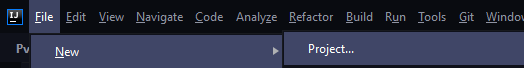
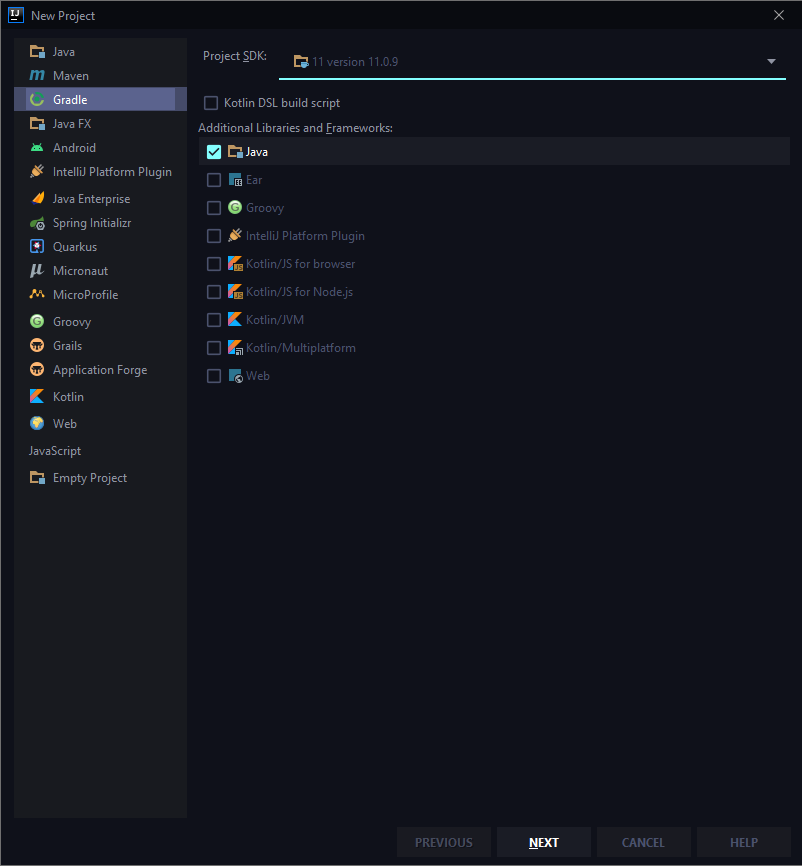
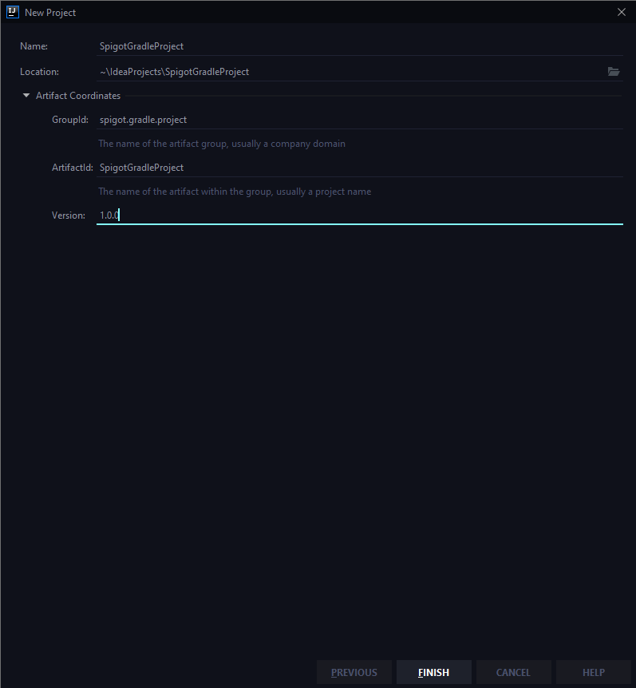
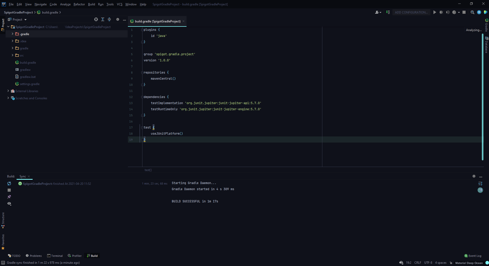
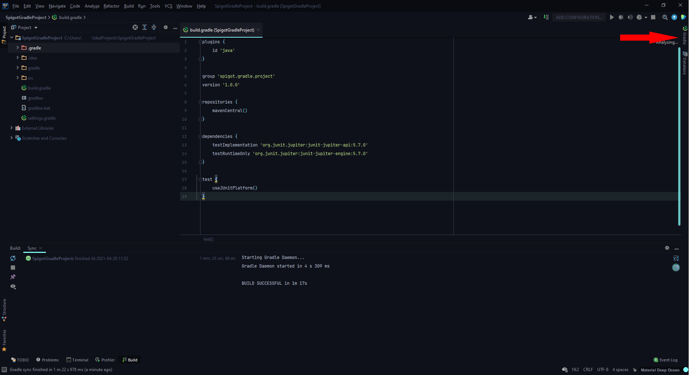
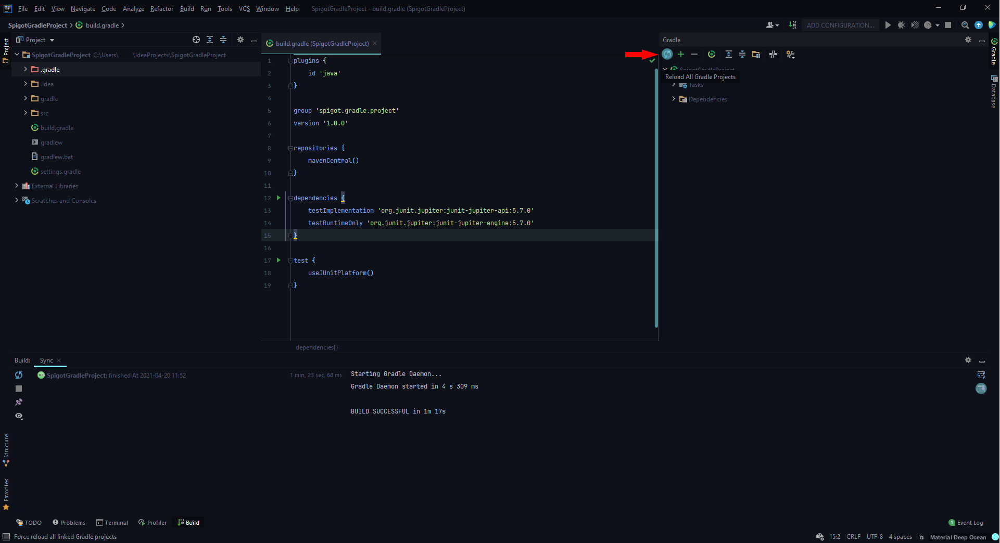
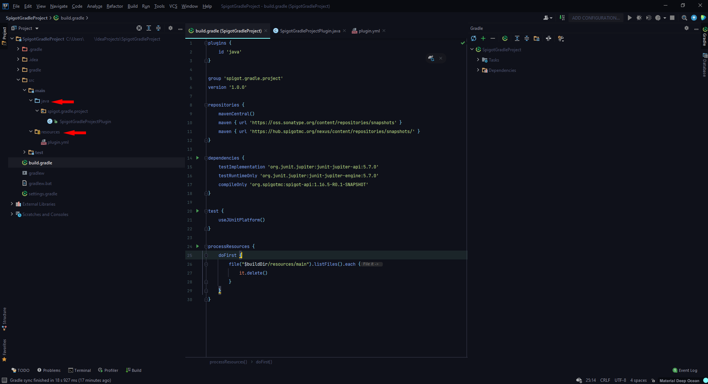
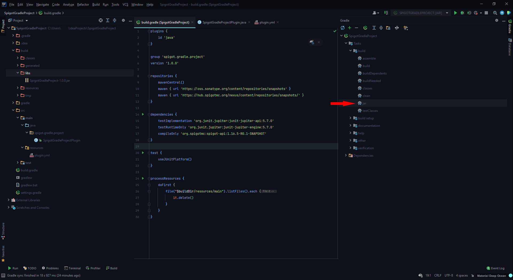
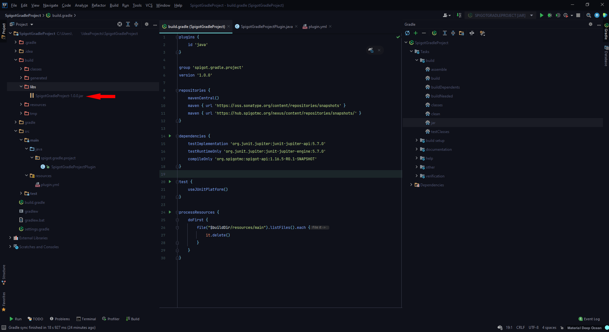

# 用 Gradle Groovy 构建你的 Spigot 插件

## 简介
当我们开发插件的时候，我们通常都是为了使过程中的事情更有效率。Gradle 是一个构建自动化工具，旨在自动化和简化 jar 生产、依赖性管理和项目管理的过程。它与 Maven 的目标相似，但与 Maven 不同的是，Gradle 既可以用命令式也可以用声明式编写，而且不是用 XML 而是用 Groovy（也有一个 Kotlin DSL）。

:::info
文档并非试图说服你 Gradle 比 Maven 更好。
:::

## 你将需要什么
在本指南中，我们还将使用 IntelliJ IDEA（v2021.1）。学习关于如何创建 Spigot 插件的基本知识。

## 让我们开始吧
首先，我们将创建一个新项目。



然后选择 Gradle 并选择 Java，我们将使用 SDK 11，但你当然也可以使用其他版本，然后下一步！



填写名称、版本和 Group ID（我们可以稍后改变它），然后完成!



现在等待所有的东西加载。一旦完成，你的项目应该看起来像这样（点击图片查看完整效果）。



我们要处理的主要文件是 `build.gradle`。如果你用过 Maven，它类似于 pom.xml。你可以在 `settings.gradle` 中改变项目的名称，这也需要 **重新加载项目** ，可以通过点击这个按钮来完成（点击图片看完整效果）。




每当你在 `build.gradle` 或 `settings.gradle` 中改变一些东西，如名称、组别、版本或添加依赖项时，就像图片中演示的那样重新加载。

要把 spigot 作为一个依赖项加入 `build.gradle` 的依赖项块中（当然你可以选择任何版本）。

```groovy
compileOnly 'org.spigotmc:spigot-api:1.16.5-R0.1-SNAPSHOT'
```

而这是在 `build.gradle` 的 repositories 块中:

```groovy
maven { url 'https://oss.sonatype.org/content/repositories/snapshots' }
maven { url 'https://hub.spigotmc.org/nexus/content/repositories/snapshots/' }
```

你的 `build.gradle` 现在应该看起来像这样:

```groovy title="build.gradle" {10,16} showLineNumbers 
plugins {
    id 'java'
}

group 'spigot.gradle.project'
version '1.0.0'

repositories {
    mavenCentral()
    maven { url 'https://hub.spigotmc.org/nexus/content/repositories/snapshots/' }
}

dependencies {
    testImplementation 'org.junit.jupiter:junit-jupiter-api:5.7.0'
    testRuntimeOnly 'org.junit.jupiter:junit-jupiter-engine:5.7.0'
    compileOnly 'org.spigotmc:spigot-api:1.16.5-R0.1-SNAPSHOT'
}

test {
    useJUnitPlatform()
}
```

现在重新加载项目！一旦你的项目完成了重新加载，你就可以开始写你的代码了，记住 `plugin.yml`! 在 Gradle 中，我们通常把我们的类放在 `./src/main/java/` 中，把我们的资源放在 `./src/main/resources/` 中（点击图片看完整效果）。



一旦你完成了编码并想测试你的杰作，运行jar任务，可以在这里找到（点击图片看完整效果）。



一旦完成，你的 jar 将在 `./build/libs/` 文件夹中准备好。(点击图片看完整效果)



恭喜你！你现在已经成功地使用 Gradle 创建了一个插件。

[跳转至官网原文](https://www.spigotmc.org/wiki/build-you-spigot-plugin-with-gradle-groovy/)
