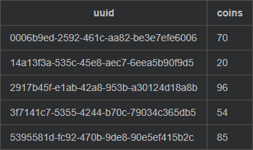
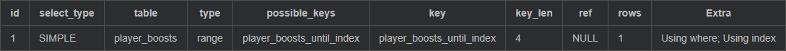
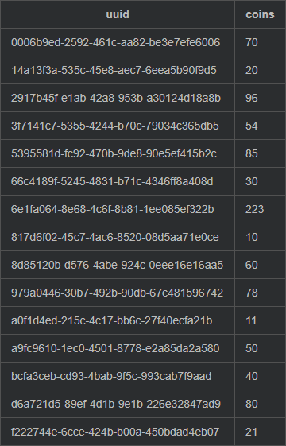
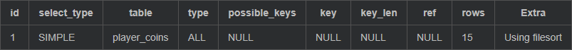
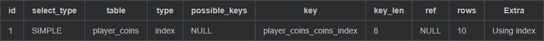

import Tabs from '@theme/Tabs';
import TabItem from '@theme/TabItem';

# 连接到数据库 - MySQL

## 介绍/我可以学到什么。

当涉及到存储数据时，数据库往往是至关重要的。
本教程旨在让你准备好在 MariaDB 或 MySQL 数据库中存储你的数据。

我们将从一些需要澄清的一般前提条件开始，并做一些准备工作。
之后，我们将研究数据源，并建立我们与数据库的第一个连接。
为了继续向数据库读写数据，我们将需要介绍一些最佳实践。这将使你更容易与你的数据库一起工作。
在这之后，我们终于可以写和读一些数据了，我们将以一个相当简单的硬币插件为例来做这件事，该插件提供和获取硬币。

读完本指南后，你将掌握如何开发一个具有稳定和良好数据库实现的应用程序的基本知识。

数据库是一个非常大的话题。我们不可能在这里涵盖所有的内容。你可能认为这已经很多了，但我们这只是冰山一角。

## 什么是数据库？

当你深入到编程的深处时，你会遇到这样的时候，你会意识到对用户和开发者来说，将数据存储在表格中，就像你在电子表格中看到的那样，比创建各种包装对象、哈希姆的哈希姆等等要方便得多。这就是数据库的用武之地。
SQL 数据库被设计用来有效地存储结构数据。它们通过将数据存储在这样的表格中来实现这一点:



看一下这个图片，我想你可能会看到这一点是如何派上用场的。数据被整齐地存储为条目或数据的行。每种数据都被分类在每一列下。
数据是以列为单位结构的。为什么我总是说数据是结构化的？因为也有非结构化的数据。在这种情况下，你会使用所谓的 noSQL 数据库，虽然 "noSQL" 这个词有点误导，因为它是一个非常广泛的领域，但这是花另一个时间的事情。

由于数据是结构化的，SQL 数据库可以做的事情远不止是存储数据。他们可以为某一列的值定义规则，甚至验证列的组合。他们还可以将不同表中的列联系在一起，并在删除被联系的行时删除掉的行。这也是保持数据一致性的一个很好的方法，但我们已经在没有澄清一些事情的情况下进入这个话题了。让我们从一些先决条件开始。

## 先决条件

为了正确地完成这项工作，我们需要一些东西来准备和阐明。

### 驱动程序的部署

当然，spigot 包含了某种 MySQL 数据库驱动，但是这个驱动从未真正打算被公众使用，而且也很老了（截至 14.4.2021，版本是 5.1.49。最新的是 8.0.23）。所以你可以用你自己的版本。
另外，只要驱动路径发生变化，或者驱动被重新定位，你的插件就会损坏。事实上，spigot 的方式不再适用于纸张，我想在这个页面上提供一个通用的最佳实践。
你可以在[这里](https://mvnrepository.com/artifact/mysql/mysql-connector-java/latest)找到最新的 MySQL 驱动。
把这个扔到你的 gradle、maven 或其他什么地方，不要忘了覆盖和重新定位这个。

我们正在使用一个标准的 MySQL 连接器，然而如果你使用 MariaDB，你也可以直接使用 MariaDB 驱动。你可以在[这里](https://mvnrepository.com/artifact/org.mariadb.jdbc/mariadb-java-client/latest)找到最新的版本。


:::caution
`ConnectionPool` 的实现在那里有点不同。该类被称为 `MariaDbPoolDataSource`。
:::

**不同的数据库 -> 不同的驱动和查询**

每个数据库都有自己的数据库驱动。几乎每个数据库都有一些不同的语法。如果你想支持不同的数据库，你可能需要对每个数据库进行不同的查询和不同的数据库驱动。如果你想让你的生活更容易一些，但又想支持多个数据库，我会向你推荐 HikariCP。

如果你正在寻找一个数据库的驱动程序，只需在谷歌上搜索 `<数据库名称> jdbc`。

:::caution
不是所有的数据库驱动都有自己的连接池实现。
:::

例如，Postgres 将在未来的版本中删除它。在这种情况下，你必须使用 HikariCP。
这主要是由于数据库驱动不应该负责实现一个适当的连接池管理。

### 异步和同步调用

这些例子都将使用同步的请求。你可能想使用异步请求来避免数据库请求拖慢你的服务器。你可以在[这里](https://www.spigotmc.org/wiki/asynchronously-working-with-a-database/)找到更多关于这方面的信息。
最后链接的资源库也包含了一个如何在 bukkit 中使用数据库异步的例子实现。

### 连接池和 HikariCP

在我们的例子中，我们将使用由 MySQL 驱动提供的池化数据源，这是最简单的方法，但是它有一些缺点。例如，MySQL 连接池没有任何办法限制你可以打开多少个连接，但你的数据库会。如果你使用了太多的 Threads 来调用你的数据库，它就会在某些方面失败。
像 [HikariCP](https://github.com/brettwooldridge/HikariCP) 这样的框架可以帮助你管理你的连接并改善你的数据库连接。
如果你想了解更多关于 HikariCP 的连接池，你可以看一下这个[线程](https://www.spigotmc.org/threads/480002/)。

### 阅读所有内容

我知道这有很多内容要读，但请你花点时间，把所有内容都读一遍。

## 使用资源进行尝试

Connection, Statement (PreparedStatement) 和 ResultSet 是 `AutoCloseable`。

这意味着它们是可以关闭的，但也可以自动关闭（显然...）。

当你打开一个连接时，这个连接将保持开放，直到它被关闭。
一个语句需要缓存，直到它被关闭。
一个结果集也会被缓存起来，直到它被关闭，或者语句被关闭。

如果你错过了关闭它，你将会有一个内存泄漏，你会阻塞连接和/或缓存。
你也可能在某个时候耗尽自由连接。

为了避免这种情况，你要使用一个 `Try-with-Resources`。

这可以确保当你离开代码块时，所有的可关闭程序都被关闭。

下面是一些 "伪代码"，向你展示了自动关闭的优势。

几乎所有地方都显示的旧的和错误的方法看起来像这样。(不要看太久，反正是错的......)

```java
try {
    Connection conn = getConnection();
    PreparedStatement stmt = conn.prepareStatement("SELECT some from stuff");
    stmt.setSomething(1, something);
    ResultSet rs = stmt.exeuteQuery();
    // 对结果集做一些处理

    // 下面的部分在大多数情况下被忽略了。许多人忘记了关闭他们的东西。
    conn.close();
    stmt.close(); // 关闭语句也会关闭该语句的结果集。
} catch (SQLException e){
    e.printStackstrace(); // 这应该用一个更好的记录解决方案来代替。 不要这样做。
}
```

有了 `AutoCloseable`，你就不必再为关闭你的东西而烦恼。

我们还将使用一个名为 `source` 的数据源，我们在我们的类中的某个地方缓存了它。
（不，我们不会通过某个静态变量来获取它。这是个糟糕的设计……)

```java
try (Connection conn = source.getConnection(); PreparedStatement stmt = conn.prepareStatement("SELECT some from stuff")) {
    ResultSet rs = stmt.exeuteQuery();
    stmt.setSomething(1, something);
    ResultSet rs = stmt.exeuteQuery();
    // 对结果集做一些处理
} catch (SQLException e) {
    e.printStackstrace(); // 这应该用一个更好的记录解决方案来代替。 不要这样做。
}
```

你可以看到，我们在这里没有关闭我们的东西，因为我们不需要它。你在 try 块的大括号 `(...)` 内指定的任何对象的任何对象都将在你退出代码块时被关闭。

这将把连接返回到我们的连接池中，为结果缓存和语句释放被封锁的内存。现在我们很高兴，并为下一个请求做好准备。

很明显，在大括号内分配的对象需要是 `AutoCloseable` 类型的。

:::tip
还有很多类是可以自动关闭的。比如说输入和输出流。请看一下你正在使用的东西，并在任何可能的地方使用资源的尝试
:::

这里还有一个补充。结果集也是自动关闭的，但我们不在 `try` 大括号内创建它。它仍然会被关闭。让我们看一下 `ResultSet` 的文档。

:::note
当生成 `ResultSet` 的 `Statement` 对象被关闭、重新执行或用于从多个结果序列中检索下一个结果时，`ResultSet` 对象会自动关闭。
:::

[源文档](https://docs.oracle.com/javase/7/docs/api/java/sql/ResultSet.html)

这就是了。这就是 Try-with-Resources。当你退出代码块时，你的连接、语句和结果集都被释放了，你不必再关心它了。

## 设置一个连接

有了关于 Try-with-Resources 的知识，我们现在可以认真起来了。是时候连接到我们的数据库了。
希望你已经导入了你想使用的数据库驱动。

首先，我们需要创建我们的数据源。就像之前提到的。每个数据库驱动都有其他的类名和类。不是所有的数据库驱动都实现了连接池，但是 MySQL 和 MariaDB 驱动实现了连接池。
要为这些数据库之一创建一个数据源，只需创建一个新的连接池实例。

<Tabs>
  <TabItem value="mysql" label="MySQL" default>

  ```java
  MysqlDataSource dataSource = new MysqlConnectionPoolDataSource();
  ```

  </TabItem>
  <TabItem value="mariadb" label="MariaDB">

  ```java
  MariaDbPoolDataSource dataSource = new MariaDbPoolDataSource();
  ```

  </TabItem>
</Tabs>

要连接到你的数据库，你需要连接数据，就像你一直需要的那样。从你的配置中加载它。不要硬编码任何东西。这是很糟糕的做法。

你的配置将包含这样的内容:

```yaml
database:
  host: localhost # 你的数据库的主机地址
  port: 3306 # MariaDB 和 MySQL 的默认端口
  database: db # 你的数据库的名称。一个数据库服务器可以包含多个数据库
  user: username
  password: passy
```

现在我们需要配置我们的数据源。两个数据源都提供了相同的方法:

```java
Database database = config.getDatabase();
// 我们设置了我们的认证
dataSource.setServerName(database.getHost());
dataSource.setPortNumber(database.getPort());
dataSource.setDatabaseName(database.getDatabase());
dataSource.setUser(database.getUser());
dataSource.setPassword(database.getPassword());
```

:::caution
每个数据库驱动实现都包含一些合理的默认值。如果你不设置端口，就会使用数据库的默认端口。默认主机总是 "localhost"。默认值取决于数据库驱动类型。
:::

:::caution 对MariaDB驱动的注意
虽然 mysql 的数据源没有实现最大连接数，但 MariaDB 的数据源实现了它。你可以通过以下方式设置它:
```java
dataSource.setMaxPoolSize(8); // 默认值是 8。8 个连接对大多数插件来说应该是足够了。
```
:::

现在我们要测试一下我们的连接。
请注意，从现在开始，我们在这里和任何地方都使用 Try-with-Resources。

```java
private void testDataSource(DataSource dataSource) throws SQLException {
    try (Connection conn = dataSource.getConnection()) {
        if (!conn.isValid(1)) {
            throw new SQLException("Could not establish database connection.");
        }
    }
}
```

这个代码段将创建一个与数据库的连接，并等待 1s 的数据库响应。
如果连接无效，我们会抛出一个异常来停止我们的进程，如果连接无法建立，数据库驱动程序会抛出一个错误。

当没有出错时，我们现在有一个工作的连接池到我们的数据库。

你可能想把上面的代码包在一个方法里面，让这个方法返回一个 `DataSource` 类:

```java
private DataSource initMySQLDataSource() throws SQLException {
    MysqlDataSource dataSource = new MysqlConnectionPoolDataSource();
    // 设置认证

    // 测试连接
    testDataSource(dataSource);
    return dataSource;
}
```

你在 `onEnable()` 方法中调用这个方法，并将返回的数据源缓存在你的插件类中的 `private DataSource dataSource` 中。

## 建立表

现在我们已经连接了我们的数据库，我们需要把我们的数据存储在某个地方。就像一开始提到的那样，SQL 数据库将数据存储在表中，但数据库能做的远不止是将数据存储在表中。它们可以验证和预先组织你的数据，以便更快地产生结果并提供数据的一致性。

我们将在本节中看看不同的方法。

### 创建一个表

要创建一个表，我们需要定义列的名称和所需的数据类型。你可以在这里找到这些类型。其中一些[类型](https://www.w3schools.com/sql/sql_datatypes.asp)有一个`(size)`
参数。对于字符串数据类型，它定义了写在这一列中的数据的最大尺寸，但是对于数字类型，它不定义。`INT(2)` 不会以任何方式限制写入该列的整数值。这是被广泛传播的错误知识。如果你想知道更多，请看[文档](https://dev.mysql.com/doc/refman/5.7/en/numeric-type-attributes.html)。

:::caution
- 其他数据库可能有不同的类型。请阅读你的数据库的文档。
- 有些类型的名称与 java 数据类型不同。例如，SQL 中的 `Bigint` 等于 Java 中的 `long`。
:::

有一些最佳做法，你必须选择哪种数据类型:

- 始终具有相同大小的字符串（如 UUID）-> char (size) (Max 255 chars)
- 已知最大尺寸的字符串（如：玩家名字）-> `VARCHAR(size)` (Max 65,535)
- 长度未知的文本 -> `TEXT` (~32,700 字符）
- 预计会很大的文本 -> `MEDIUMTEXT`（16,777,215 个字符）或 `LONGTEXT`（4,294,967,295 个字符）。

我建议你深入研究一下文档。

一个为玩家存储硬币的表的例子是这样的:

```sql
-- 始终确保使用 "if not exists"，以避免在表已经定义时出现错误。CREATE TABLE IF NOT EXISTS player_coins
(
    -- 一个 uuid 有 36 个字符。
    -- 这就是为什么我们定义的 uuid 大小为 36。
    -- 我们还说这个列不应该是空的。
    uuid  CHAR(36)         NOT NULL,
    -- 我们用 bigint 创建一个硬币列。这相当于 java 中的一个 long。
    -- 我们还说这个列不应该是空的。
    -- 如果你只是在这个表中插入一个新的 uuid，默认情况下，硬币列将是 0。
    coins BIGINT DEFAULT 0 NOT NULL,
    -- 我们在 uuid 列上创建一个主键 "coins_pk"。
    -- 这意味着 uuid 列中的一个值只能在该列中出现一次。
    PRIMARY KEY (uuid)
);
```

你可能已经注意到，除了列的类型，还有一些其他的参数。我们稍后会讨论这个问题。

### 数据一致性

SQL 表不仅仅是表。它们有某种自己的思想，可以决定哪些数据可以插入，以及应该如何插入。

### 默认值

`default` 关键字是相当有用的。
如果你看一下我们上面的语句，你会发现硬币有一个默认值。
这意味着每当我们向这个表插入一个新的 uuid 而不向 `coins` 列插入一个值时，这个值将是 0。

### 不为空

`not null` 这个关键字应该是很明显的。它可以防止你或其他人在这一列中插入 `null`。
这也是相当有用的。
你永远不希望在你的表中有一些硬币的 uuid 为 `null`，或者一个 uuid 的 coin 为 `null`。

### 主键

我们的主键（uuid）为 uuid 列创建一个主键。
这有两个好处:

- 一个 UUID 在这个表中不能存在超过一次。
- 在 uuid 列上创建了一个索引，从而加快了你对特定 uuid 的搜索。

第一个优点被称为约束。第二个优点被称为索引。一个主键是二者合一的。

### 约束和索引

一个表只能有一个主键，但你可能想有更多的约束，以获得更好的数据一致性和更快的搜索。
这就是为什么我们可以为我们的表创建自己的约束和索引。

为了向你展示这一点，我们需要一个更复杂的表:

```sql
CREATE TABLE IF NOT EXISTS player_boosts
(
    uuid     CHAR(36)  NOT NULL,
    boost_id INT       NOT NULL,
    until    TIMESTAMP NOT NULL,
    CONSTRAINT player_boosts_constraint
        UNIQUE (uuid, boost_id)
);

CREATE INDEX IF NOT EXISTS player_boosts_until_index
    ON player_boosts (until ASC);
```

助推器表包含所有拥有有效助推器的用户和一个 `boost_id`。它还包含一个时间戳，这个助推器将在何时用完。

由于我们有不止一个助推器，所以我们希望一个 uuid 能在这个表中多次出现，但我们不希望同一个玩家的同一个 booster 能在这个表中多次出现。这就是为什么我们的 `CONSTRAINT` 是 `uuid` 和 `boost_id` 的组合。这意味着这两列的组合在这个表中必须是唯一的。

在目前的情况下，`CONSTRAINT` 可以被一个主键所取代。我在这里使用它是因为我想向你展示它的语法。当你有更复杂的表时，你可能会在主键旁边需要更多的约束。

注意：约束和索引的名字可以自由选择，但是建议使用有用的名字。

然而，这里发生了一些其他有趣的事情。我们在 `until` 列上创建了一个索引。这个索引是排序的，这意味着我们已经有了这个按 `until` 时间戳排序的表。我们将把最低的时间戳放在最上面，把远期的时间戳放在表的最后。

由于我们可能想看看哪些助推器很快就会用完，我们想选择最近的助推器结束。我们可以通过对表进行排序，然后选择下一个 X 条目来达到这个目的。

作为一个查询，这看起来像这样（别担心。这里的一切将在后面解释。在文章的末尾会有进一步的解释）:

```sql
EXPLAIN SELECT
    uuid,
    boost_id FROM
    player_boosts WHERE until < date_sub(now(), INTERVAL 1 HOUR);
```



## 设置你的数据库

现在我们已经连接好了，我们需要确保我们能在数据库中找到我们要找的表。
大多数人在他们的代码中通过写很长的表创建语句来实现这一点。我们不会这样做。
我们将在我们的插件中的一个文件中提供我们所需的表布局。
不在代码中直接包含大的 sql 语句被认为是最好的做法。这可能会随着 java 15 后可能会有所改变，因为它现在允许 quoteblocks，但我们知道，在我们能够在 minecraft 服务器上使用 java 15 之前，这将是一个很长的时间，所以我们坚持使用 "老式" 方法。

在你的资源中创建一个文件 `dbsetup.sql`。
我们现在在这个文件中编写所有的语句来创建我们的表:

```sql
CREATE TABLE IF NOT EXISTS something
(
    [...]
);

CREATE TABLE IF NOT EXISTS somewhat
(
    [...]
);
[...]
```

请注意，我们在每个语句的结尾都有一个`;`，这是为了知道语句的结束位置。我们还在所有地方使用 `IF NOT EXISTS` 关键字，否则我们的设置会在下次启动时失败。

现在我们需要在我们的数据库中执行这个程序。
为此，我们将在我们的插件中创建一个 `initDb()`方法，并在我们的数据源分配后调用它。

这个方法将读取我们的 `dbsetup.sql` 文件，并在我们的数据库中逐一执行这些语句。
请注意，这个方法会在出错时抛出一个 SQLException。
这将中止设置，因为没有正确初始化的数据库，运行我们的插件是没有意义的。

```java
private void initDb() throws SQLException, IOException {
    // 首先让我们阅读我们的设置文件。
    // 这个文件包含创建初始表的语句。
    // 它位于资源中。
    String setup;
    try (InputStream in = getClassLoader().getResourceAsStream("dbsetup.sql")) {
        // Java 9 以上的方式
        setup = new String(in.readAllBytes());
        // 传统方式
        setup = new BufferedReader(new InputStreamReader(in)).lines().collect(Collectors.joining("\n"));
    } catch (IOException e) {
        getLogger().log(Level.SEVERE, "Could not read db setup file.", e);
        throw e;
    }
    // Mariadb 每个语句只能处理一个查询。我们需要在 ; 处进行分割。
    String[] queries = setup.split(";");
    // 执行对数据库的每个查询
    for (String query : queries) {
        // 如果你使用传统的方式，你必须在这里检查是否有空查询。
        if (query.isBlank()) continue;
        try (Connection conn = dataSource.getConnection();
             PreparedStatement stmt = conn.prepareStatement(query)) {
            stmt.execute();
        }
    }
    getLogger().info("§2Database setup complete.");
}
```

在我们的脚本被执行后，所有的表都应该被创建，我们就可以开始了。

### 关于版本控制的附注

数据库的版本管理是很难的，而且也没有很多最佳实践，不过我使用了一个带有设置、增量补丁和迁移文件的系统来完成这个工作。这个系统对大多数插件来说可能是不需要的，所以如果你不感兴趣，可以跳过这一点。

如果你想跟踪你的数据库版本，创建一个单一的表，比如:

```sql
CREATE TABLE IF NOT EXISTS plugin_name_db_version
(
    version INT NOT NULL,
    patch   INT NOT NULL
);
```

这个表应该包含你的数据库的版本和补丁版本。
你可以在启动时检查你的数据库有哪个版本。
现在你可以在你的插件中加入增量的补丁文件，其结构是这样的。

```yaml
 database/1/setup.sql database/1/patch_1.sql database/1/patch_2.sql database/1/patch_3.sql database/1/migrate.sql database/2/setup.sql database/2/patch_1.sql database/2/patch_2.sql
 ```

`setup ` 文件包含了一个完整的新数据库设置。如果没有数据库，就使用这些文件。
`patch` 文件被应用在 `setup` 上，直到达到当前的版本。
如果主要版本需要改变，所有的补丁将首先被应用，然后执行 `migrate` 迁移脚本。
当然，你需要在你的插件中的某个地方存储你所需要的数据库版本。

## 最佳实践

在与数据库合作的过程中，我发现了一些最佳实践，我想与你分享。

### 预备语句

在向数据库中写入用户输入时，使用准备好的语句是至关重要的。
预备语句将保护你免受 `SQLInjection`。它们也会提高性能，因为数据库可以更好地缓存这些语句。
他们还将确保你的值被正确解释。因此，你的字符串保持为字符串，而你的整数保持为整数。

你可以在下面看到一个准备好的语句。现在先不要考虑 SQL 查询本身。
你可能会注意到查询中的`?`。这些是实际值的占位符。
这些值是由 `PreparedStatement` 对象提供的 `set...()` 方法设置的。
你需要选择正确的方法来设置你的值，这是很直接的。然后你输入你想替换的 `?` 的编号，并在那里添加你想设置的值。占位符的索引不是基于零的，而是从 1 开始。

```java
public boolean someMethod(Object obj1, Object obj2) {
    try (Connection conn = conn(); PreparedStatement stmt = conn.prepareStatement(
            "INSERT INTO player_coins(uuid, coins) VALUES(?, ?);"
    )) {
        stmt.setSomething(1, obj1);
        stmt.setSomething(2, obj2);
        stmt.execute();
        return true;
    } catch (SQLException e) {
        logSQLError("Something went wrong.", e);
    }
    return false;
}
```

### 使用 Optional

当你与数据库打交道时，`Optional` 类是相当有用的。

当你从数据库中请求数据时，你有几种可能的结果:

- 我们找到了数据
- 我们没有找到数据
- 发生了一个错误

你不希望在发生错误或没有数据返回的情况下传递错误的数据。
`Optional` 表明这个函数可以返回一个值，但它也说它有可能不返回任何值。
旧的方法是返回 `null` 或默认值，但这是不好的风格，而且你可能会忘记执行 null 检查。

这个 `Optional` 可以非常简单地使用:

```java
// 一个空的可选项。旧的空值。Optional.empty()
// 将值包装成一个可选的 Optional.of(anyValue)
// 封装一个可能为空的值。如果该值是空的，这就等于Optional.empty()
Optional.ofNullable(anyValue)
```

有一些特殊的 Optionals 是为特定类型设计的，如 OptionalLong, OptionalInt, OptionalDouble 和 OptionalBoolean。

一般来说，整个思路是这样的:

```java
public OptionalLong getCoins(Player player) {
    try (Connection conn = conn(); PreparedStatement stmt = conn.prepareStatement(
            "select coins from player_coins where uuid = ?;"
    )) {
        stmt.setString(1, player.getUniqueId().toString());
        ResultSet resultSet = stmt.executeQuery();
        if (resultSet.next()) {
            return OptionalLong.of(resultSet.getLong("coins"));
        }
        return OptionalLong.empty();
    } catch (SQLException e) {
        logSQLError("Could not retrieve player coins.", e);
        return OptionalLong.empty();
    }
}
```

如果我们得到一个错误或在数据库中没有发现任何东西，我们会返回 `OptionalLong.empty()`。这将表明我们没有或无法检索到任何数据。
如果我们找到了数据，我们就把它包装成一个 Optional。

### 返回布尔值

如果我们没有返回任何数据，我们仍然想知道我们的交易是否成功，在这种情况下，我们只是在出现异常的情况下返回 false，否则返回 true。
这将防止我们在出错时发送一个确认信息:

```java
public boolean someMethod(Object obj1, Object obj2) {
    try (Connection conn = conn(); PreparedStatement stmt = conn.prepareStatement(
            "INSERT INTO player_coins(uuid, coins) VALUES(?, ?);"
    )) {
        stmt.setSomething(1, obj1);
        stmt.setSomething(2, obj2);
        stmt.execute();
        return true;
    } catch (SQLException e) {
        logSQLError("Something went wrong.", e);
    }
    return false;
}
```

## 利用数据工作

现在，我们终于可以进入最酷的部分了。
是时候使用一些数据了!
本节将涵盖所有的基本操作，你将需要开始与你的数据库一起工作。

由于篇幅原因，我将只向你展示准备好的语句，没有任何 java 代码。

我们的表看起来像这样:

```sql
CREATE TABLE IF NOT EXISTS player_coins_2
(
    uuid  CHAR(36)         NOT NULL,
    coins BIGINT DEFAULT 0 NOT NULL,
    PRIMARY KEY (uuid)
);
```

任何值都不允许为空，每个 `uuid` 在这个表中只能出现一次。

### 写入数据

写入数据是必不可少的。如果我们不写，我们应该读什么？
所以让我们从写开始。我们有三种不同的方式。`INSERT`、`UPSERT` 和 `REPLACE`

#### Insert

`INSERT` 语句可能是最常见的，也是最简单的模式之一。
你将一些数据插入到一个表的某些列中。

还记得前面的约束条件吗？你需要以正确的方式插入数据，否则它们将阻止你插入数据。如果我们违反了表的任何规则，插入将失败。

因此，让我们插入一些数据:

```java
public boolean addCoins(Player player, long amount) {
    try (Connection conn = conn(); PreparedStatement stmt = conn.prepareStatement(
            "INSERT INTO player_coins(uuid, coins) VALUES(?, ?)")) {
        stmt.setString(1, player.getUniqueId().toString());
        stmt.setLong(2, amount);
        stmt.execute();
        return true;
    } catch (SQLException e) {
        logSQLError("Could not add coins", e);
    }
    return false;
}
```

 
这对初学者来说是超级方便的。
然而基本的插入并不常见，因为你通常在你的表中有某种逻辑。
因为我们有主键，所以这个插入只能工作一次。
如果我们没有主键，我们将不得不计算每个玩家的每个条目中的硬币，这将比仅仅更新它的工作要多得多，对吗？
这就是我们需要的 upsert。

#### Upsert

`upsert` 是 `INSERT` 和 `UPDATE` 的混合体。

```java
public boolean addCoins(Player player, long amount) {
    try (Connection conn = conn(); PreparedStatement stmt = conn.prepareStatement(
            "INSERT INTO player_coins(uuid, coins) VALUES(?, ?) ON DUPLICATE KEY UPDATE coins = coins + ?;")) {
        stmt.setString(1, player.getUniqueId().toString());
        stmt.setLong(2, amount);
        stmt.setLong(3, amount);
        stmt.execute();
        return true;
    } catch (SQLException e) {
        logSQLError("Could not add coins", e);
    }
    return false;
}
```

你可以看到，这与上面的INSERT语句很相似。这一次我们在结尾处添加了一些东西。
关于重复键的更新
这意味着，如果我们遇到一个重复的键（在我们的例子中是uuid），我们要更新这个条目，否则我们就直接插入它。
我们通过将coins列的值设置为当前的硬币数加上我们想要添加的值来实现这一目的 coins = coins + ?

你可能永远也不会想直接插入数据。

### 更新数据

更新数据和插入数据一样重要。

大多数时候，你想更新数据而不是插入新数据。你有两种不同的方法来做到这一点。

#### Replace

替换类似于 `upsert`，但我们不是更新值，而是用另一个值替换它或插入它。它是 `UPDATE` 和 `INSERT` 的混合:

```java
public boolean setCoins(Player player, long amount) {
    try (Connection conn = conn(); PreparedStatement stmt = conn.prepareStatement(
            "REPLACE player_coins(uuid, coins) VALUES(?, ?);"
    )) {
        stmt.setString(1, player.getUniqueId().toString());
        stmt.setLong(2, amount);
        stmt.execute();
        return true;
    } catch (SQLException e) {
        logSQLError("Could not set coins", e);
    }
    return false;
}
```

#### Update

我们也可以用 `UPDATE` 做同样的事情。在这种方式下，我们只在我们的键有条目的情况下更新数据。

```java
public boolean setCoins(Player player, long amount) {
    try (Connection conn = conn(); PreparedStatement stmt = conn.prepareStatement(
            "UPDATE player_coins SET coins = ? WHERE uuid = ?"
    )) {
        stmt.setLong(1, amount);
        stmt.setString(2, player.getUniqueId().toString());
        return stmt.executeUpdate() > 0;
    } catch (SQLException e) {
        logSQLError("Could not set coins", e);
    }
    return false;
}
```

你在这里看到了新的东西。`WHERE` 子句定义了我们要更新的列。这次我们说我们要更新特定 `uuid` 上的硬币。
我们的返回值也发生了变化。`executeUpdate()` 方法返回我们所更新的行数。如果结果是 0，我们没有更新任何东西，所以我们返回 `false`。

这个机制可以用来做一些漂亮的线程保存取操作，而不需要检查玩家是否有足够的硬币。

```java
public boolean takeCoins(Player player, long amount) {
    try (Connection conn = conn(); PreparedStatement stmt = conn.prepareStatement(
            "UPDATE player_coins SET coins = coins - ? WHERE uuid = ? AND coins >= ?;"
    )) {
        stmt.setLong(1, amount);
        stmt.setString(2, player.getUniqueId().toString());
        stmt.setLong(3, amount);
        int updated = stmt.executeUpdate();
        return updated == 1;
    } catch (SQLException e) {
        logSQLError("Could not take coins from player.", e);
    }
    return false;
}
```

如果玩家有足够的硬币，这个方法将从一个有特定 uuid 的玩家那里获取硬币。
如果我们得到一个更新的行，我们知道该玩家有足够的钱。
只要你想从一个玩家那里拿一个东西，如果他有足够的信用额度，就可以使用这个方法。如果你首先检查玩家是否有足够的信用额度，并在他有信用额度的情况下取走它，你就失去了线程安全。

#### 删除数据

有时你需要从你的表中删除数据。

```java
public boolean deleteCoins(Player player) {
    try (Connection conn = conn(); PreparedStatement stmt = conn.prepareStatement(
            "DELETE FROM player_coins WHERE uuid = ?;"
    )) {
        stmt.setString(1, player.getUniqueId().toString());
        int updated = stmt.executeUpdate();
        return updated == 1;
    } catch (SQLException e) {
        logSQLError("Could not delete coins of player.", e);
    }
    return false;
}
```

`DELETE` 语句也是一种更新的类型。这就是为什么我们可以使用同样的机制，像前面一样，检查我们是否删除了玩家。
如果你在没有 `WHERE` 的情况下执行 `DELETE`，你的整个表将被抹去，这与 `TRUNCATE` 的效果相同。

### 读取数据

现在你可以在数据库中管理你的数据了，终于到了读取数据的时候了。

结果集
每当你通过 SELECT 语句请求数据时，你会得到一个 `ResultSet`。
为了获得 `ResultSet`，你需要在你的语句中使用 `executeQuery()` 方法。

一个结果集包含你请求的行。这些行是由一个指针选择的。当你得到结果集的时候，这个指针会在第一行之前。

为了将指针移到下一行，你必须在你的 `ResultSet` 上调用 `next()` 方法。这个方法不仅可以将指针向前移动，还可以告诉你是否有一行。
如果 next 返回 `false`，则不能读取任何行。

#### 选择单一行

如果你通过一个主键选择一条记录，比如我们的 uuid，你将只得到一条记录。

```java
public OptionalLong getCoins(Player player) {
    try (Connection conn = conn(); PreparedStatement stmt = conn.prepareStatement(
            "SELECT coins FROM player_coins WHERE uuid = ?;"
    )) {
        stmt.setString(1, player.getUniqueId().toString());
        ResultSet resultSet = stmt.executeQuery();
        if (resultSet.next()) {
            return OptionalLong.of(resultSet.getLong("coins"));
        }
        return OptionalLong.of(0);
    } catch (SQLException e) {
        logSQLError("Could not retrieve player coins.", e);
        return OptionalLong.empty();
    }
}
```

我们用 `next()` 方法检查我们的 `ResultSet` 是否包含一行，如果是，我们就得到名字为 coins 的列。一个 `*` 选择器应该被避免。对于阅读你的代码的其他人来说，这是不可读的，也是不好的做法。

#### 选择多行

如果我们想选择多行，我们必须做得有点不同。

```java
public Optional<List<CoinPlayer>> getCoins() {
    try (Connection conn = conn(); PreparedStatement stmt = conn.prepareStatement(
            "SELECT uuid, coins FROM player_coins;"
    )) {
        ResultSet resultSet = stmt.executeQuery();
        List<CoinPlayer> coins = new ArrayList<>();
        while (resultSet.next()) {
            coins.add(
                    new CoinPlayer(
                            UUID.fromString(resultSet.getString("uuid")),
                            resultSet.getLong("coins"))
            );
        }
        return Optional.of(coins);
    } catch (SQLException e) {
        logSQLError("Could not fetch all player coins", e);
        return Optional.empty();
    }
}
```

你在这里看到几个新的东西。
首先，我们选择了两列（我们没有使用 *，尽管我们选择了所有列）。
然后我们用 `while` 循环浏览 `ResultSet`，将指针移到下一行，直到我们碰到 `ResultSet` 的结尾。
另外请注意，结果被包装成一个硬币播放器。这比仅仅返回一个地图或其他东西要干净得多。特别是当你想返回多行时，你应该把它们包装成一个对象。

#### 只选择你需要的东西

只有在非常罕见的情况下，你才会需要完整的表。在大多数情况下，你拉出表来在本地做一些排序，然而数据库也可以这样做。
不要选择你不需要的东西。

比方说，我们想得到拥有最多硬币的前 x 名玩家。
当然，你可以拉出完整的表格，在 java 中进行排序，然后得到一个前 x 名的子列表。
但这更容易:

```java
public Optional<List<CoinPlayer>> getTopCoins(int amount) {
    try (Connection conn = conn(); PreparedStatement stmt = conn.prepareStatement(
            "SELECT uuid, coins FROM player_coins ORDER BY coins DESC LIMIT ?;"
    )) {
        ResultSet resultSet = stmt.executeQuery();
        List<CoinPlayer> coins = new LinkedList<>();
        while (resultSet.next()) {
            coins.add(
                    new CoinPlayer(
                            UUID.fromString(resultSet.getString("uuid")),
                            resultSet.getLong("coins"))
            );
        }
        return Optional.of(coins);
    } catch (SQLException e) {
        logSQLError("Could not fetch all player coins", e);
        return Optional.empty();
    }
}
```

`ORDER BY ... DESC` 子句将整个表按硬币的降序排序。
`LIMIT `关键字将只返回拥有最多硬币的 x 个玩家。

当读取结果集时，你已经有了分类列表中的 x 个顶级玩家。

## 值得注意的事项

本节将包含一些在文章中没有找到自己位置的注意事项。

### 分类指数和 `EXPLAIN`

还记得我们之前的玩家硬币吗？我插入了一些数据:



为了进一步加快你的搜索速度，你可以创建一个已经预排序的索引，从顶层硬币的例子来看。当你这样做时，你的数据库不必再进行排序，可以直接通过查看索引来检索结果，目前的做法是这样的:

```sql
SELECT
   uuid,
   coins FROM
   player_coins ORDER BY coins DESC LIMIT 10;
```

我们读取整个表，按硬币排序，然后取前 10 行。你的数据库也可以告诉你这些。
运行这个查询:

```sql
EXPLAIN SELECT
   uuid,
   coins FROM
   player_coins ORDER BY coins DESC LIMIT 10;
```

`EXPLAIN` 关键字向你展示了数据库将做什么，目前我们的解释看起来是这样的:



类型表明我们正在使用表中的所有条目。Rows 表示我们正在读取 15 行，这是表中的所有行，我们正在使用 filesort，这不是相当快。

现在执行这个查询:

```sql
CREATE INDEX player_coins_coins_index
   ON player_coins (coins DESC);
```

这将在表中创建一个按硬币降序排序的分类索引。你还记得，我们在之前的查询中使用了 `ORDER BY` 子句。这个查询现在将读取索引而不是表本身，这相当快，因为它只是从索引中获取前 x 个条目，而不是读取所有的值进行排序，然后获取前 x 个条目。

你可以通过再次使用上面的 `EXPLAIN` 语句来检查这一点。



你可以看到，有些事情发生了变化:

- 类型从 `ALL` 变成了 `index`，这意味着我们只搜索索引而不是整个表。
- 键从 `null` 变成了 `player_coins_coins_index`，这表明我们正在使用之前创建的索引。
- 行数从 15 条减少到 10 条，这意味着我们只读取我们想要返回的行。表中的所有行。我们使用索引作为搜索类型，而不是全部，并且额外提到了我们正在使用索引而不是表。
- 任何 `extra` 的东西都从 `Using filesort` 改为 `Using index`。

这很好。我们的索引工作得很完美 我们没有读取整个表，而是读取了索引，而且我们只是读取了索引的一部分，因为索引是排序的。

## 结论

你现在有了为你的应用程序创建一些合理的表布局的工具，然而你只是读了基础知识。当涉及到 SQL 数据库时，还有很多东西需要学习。

数据库可以比你的应用程序更快、更好地完成很多工作。记住要始终使用约束条件来保持数据的一致性，并在你想搜索的列上设置索引。尽量在你的查询中做尽可能多的预排序和过滤，而不是在数据库外读取数据并排序。

请不要忘记使用准备好的语句和数据源。这些将使你的生活变得更加轻松。

如果你想学习更多的东西，你可能想看看下面的进一步阅读部分。

## 更多内容

可以在[这里](https://github.com/RainbowDashLabs/BasicSQLPlugin)找到一个包含所有显示的查询和东西的示例实现。在资源库中也可以找到一个异步的实现。欢迎投稿。

如何使用 HikariCP 的指南可以在[这里](https://www.spigotmc.org/threads/480002/)找到。

如何在 bukkit 中异步使用数据库的文章可以在[这里](https://www.spigotmc.org/wiki/asynchronously-working-with-a-database/)找到。

[跳转至官网原文](https://www.spigotmc.org/wiki/connecting-to-databases-mysql/)
